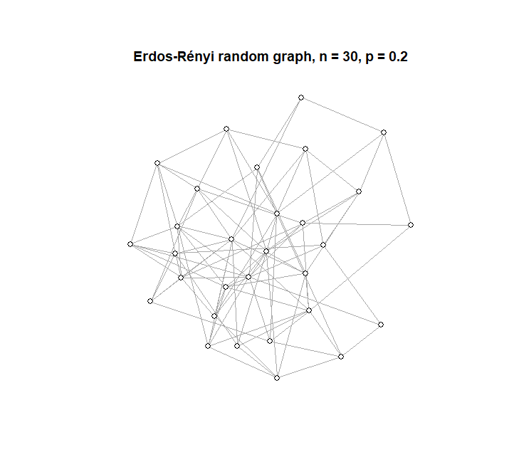

### What is the Reed-Frost Model?
The Reed-Frost model is a simple epidemiologic model for the spread of disease through a population. In this model, each individual in the population takes one of three possible states: Susceptible (S), Infected (I), or Recovered (R).

At each time step, each infected (I) individual has some probability p of coming into contact with each susceptible (S) individual, independently of the others. If a susceptible individual comes into contact with at least one infected individual, they will become infected for the next time step and recovered (R) the time step after that. As such, each infected individual is only infected for one time step and cannot be re-infected after they reach 'recovered' status.

### What does this look like?
The examples below show a few different Reed-Frost simulations with a population size of 150 and 1 initial infection.

<html>
  
First, let's try the simulation with p=0.005 (in other words, there is a 0.5% chance of contact between each pair of individuals in the population at each time step). With this small value of p, we can see that the disease dies out before most of the population gets infected. Think of this as the effect of social distancing: if there is less contact between individuals in the population, there will be fewer opportunities for infection.

<iframe width="500" height="400" src="rfvideo3.mp4"></iframe>
   

Now let's try the simulation with a higher probability of contact, p=0.015. In this example, the disease spreads much more quickly through the population, but there are still some people who never get infected.
  
<iframe width="500" height="400" src="rfvideo.mp4"></iframe>
 

Finally, let's try p=0.05. In this example, contact between individuals is more likely, and the disease quickly spreads to the entire population.

<iframe width="500" height="400" src="rfvideo2.mp4"></iframe>
   
</html>

### Connection to the Erdős-Rényi random graph

The Erdős-Rényi model is one method of generating a random graph. Start with a graph of n vertices. For each pair of vertices, add an edge between them with some probability p, independently of all the other pairs.  

The state of a Reed-Frost model with one initial infection at a given time t can be extrapolated from an Erdős-Rényi random graph using the graph distance between each vertex and the initial infected vertex.

### Additional resources
See [Wikipedia](https://en.wikipedia.org/wiki/Reed%E2%80%93Frost_model) for more information on the Reed-Frost model.  
See [Wikipedia](https://en.wikipedia.org/wiki/Erd%C5%91s%E2%80%93R%C3%A9nyi_model) for more information on the Erdős-Rényi random graph.  
See [this chapter](https://www-cambridge-org.offcampus.lib.washington.edu/core/books/epidemics-and-rumours-in-complex-networks/reedfrost-epidemics-and-erdsrenyi-random-graphs/C59F42D33598700008672D1A717BDBB8#) of the book _Epidemics and Rumours in Complex Networks_ by Moez Draief and Laurent Massoulié for a full explanation of the connection between the Reed-Frost model and the Erdős-Rényi random graph.  

[View](https://github.com/jamie-forschmiedt/reedfrost/blob/gh-pages/ReedFrostVideo.R) the R code for the Reed-Frost simulation on GitHub.  
[Download](https://downgit.github.io/#/home?url=https://github.com/jamie-forschmiedt/reedfrost/blob/gh-pages/ReedFrostVideo.R) the R code for the simulation.
